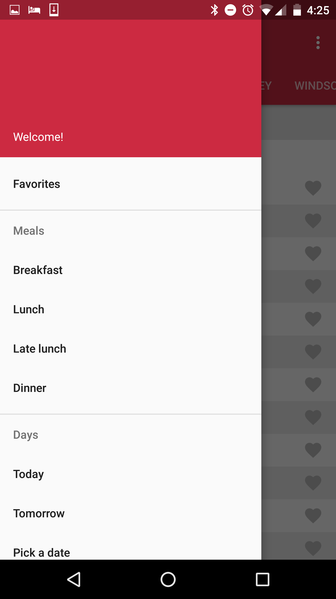
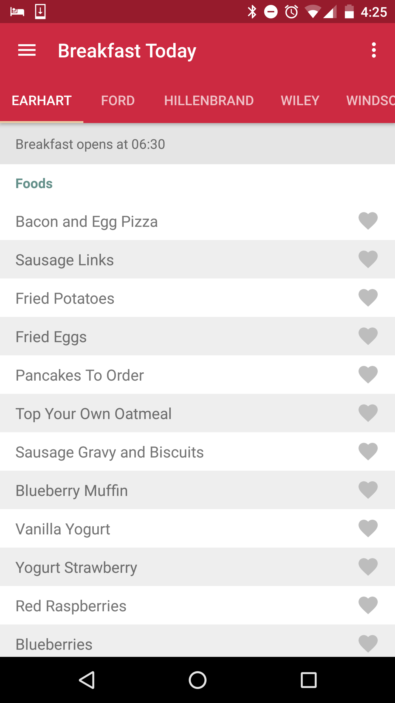

# Material Design Dining Courts

There are so many apps for the Purdue dining courts, but they don't seem to understand how people
want to look for food. 

This app aims to change that!

 

## Features

### Choosing a dining court

Most apps for the dining courts make you find a meal by listing all the dining courts then making you click into each one INDIVIDUALLY!? This doesn't let you compare options at ALL!
In this app, the dining courts are tabbed and you can swipe between locations rather than swiping between meals like the competition. 

### Who cares about the stations, really?

Stations are mostly pointless. All they do is separate all the information you want to see when looking for food. 
This app removes stations completely and aims to sort your food by something more helpful, whether it is an Entree, a Side, or a Desert. Typically you only care what Entrees are being served anyway.

### Favorites

You always have to favorite things. We move your favorites to the top so you know where you what place will feed you best. 

## Material Design

I love material design, and this is my first app heavily implementing it. Most of the UI guidance and design is coming from Ben Wenke and is implemented by David Tschida. 

## Upcoming features

I want to add a lot to this app and I have some fun ideas I want to try. 

- Adding alerts for when a favorite food is going to be at a dining court near you
- Recommending a place to eat based on time of day and favorites at a location
- Sorting foods by their types, such as Entree, Side, or Desert. 
- If this app gains enough users it could be used to track how crowded each location is at any time. 

## Contributing

I would love to have people add to this app or fork it into their own. Send me a Pull Request and if I think your code is good enough I'll give you push rights on the code. 

I could use some help croudsourcing the meal types too, contact me and I will send you a "datalogger" flavor of the APK (or make it yourself from the feature_buildflavors branch) and send me an email through the app with the data you gather. 

## License

This app is obviously open source. I just need to get around to grabbing a license... Until then please be nice and give me a little credit in your code if you use my stuff. 

